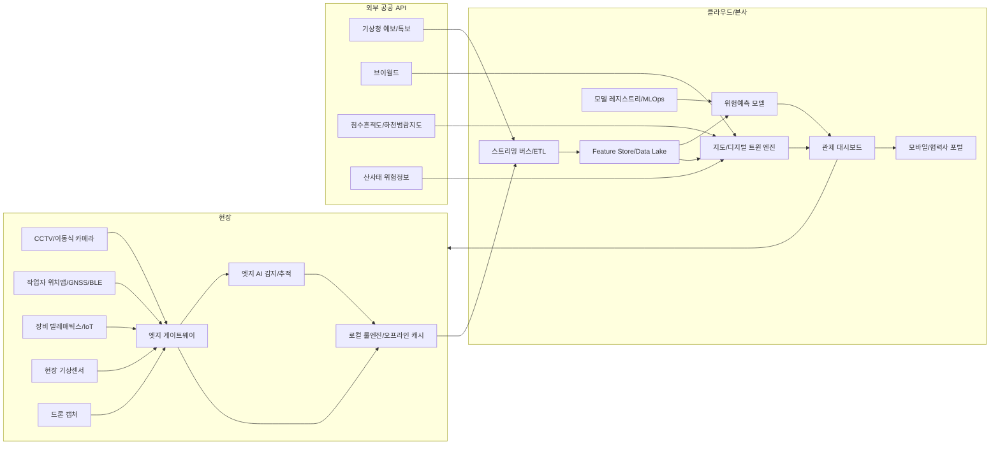
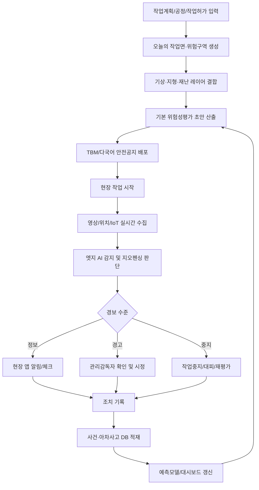
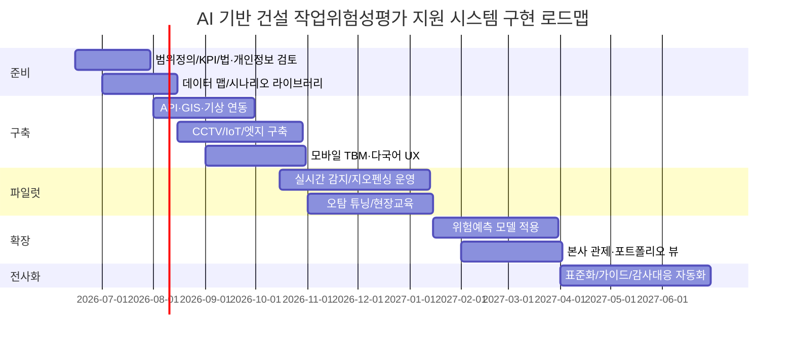

# AI 기반 건설업 작업위험성평가 지원 시스템 심층 보고서

## 요약문

건설업 작업위험성평가 지원 시스템은 단순히 종이 체크리스트를 디지털화하는 수준으로는 충분하지 않다. 국내 법 체계상 사업주는 위험성평가를 실시하고 결과와 조치사항을 기록·보존해야 하며, 최근 고용노동부의 위험성평가 지침도 현장의 유해·위험요인 파악, 위험성 결정, 감소대책 수립·실행의 체계를 명확히 요구한다. 동시에 건설현장은 작업 위치가 수시로 바뀌고, 공정·장비·근로자 동선이 매일 변하며, 야외 노출로 인해 폭염·호우·강풍·침수·산사태 같은 외부 위험요인이 급격히 바뀐다. 따라서 적합한 시스템은 **정적인 사전 문서 작성 도구**가 아니라, **작업면·시간·기상·지형·장비·인력 상태를 계속 재계산하는 동적 위험운영체계**여야 한다. citeturn39search12turn39search6turn12search0turn28search5turn9search11

기술적으로는 **규칙기반 안전통제 + 위치기반 공간엔진 + 영상 AI + 예측분석**의 4계층 구조가 가장 실무적이다. 규칙기반 계층은 법정 작업계획서, 위험성평가, TBM, 기상특보, 작업중지 기준을 즉시 반영한다. 공간엔진은 작업자와 장비의 상대위치, 이동경로, 작업구역 지오펜스를 관리한다. 영상 AI는 PPE, 추락위험, 장비 협착, 화재·연기 등 관찰 가능한 위해를 감지한다. 예측분석은 사고·아차사고·기상·공정 조합에서 다음 24시간 내 고위험 작업면을 우선순위화한다. 이때 한국형 시스템은 기상청 단기·특보 API, 브이월드 2D/3D 지도, 생활안전지도 침수·하천범람지도, 산림청 산사태정보, 현장 CCTV/드론/IoT를 함께 묶는 구조가 유리하다. citeturn7search0turn7search7turn6search6turn8search0turn10search6turn10search10turn9search0turn36search0turn38search0

한국 기준의 구현에서는 세 가지가 특히 중요하다. 첫째, 산업안전보건법 제36조와 위험성평가 지침을 충족하도록 **평가-조치-기록-재평가**의 폐루프를 남겨야 한다. 둘째, 중대재해처벌법 시행령이 요구하는 안전보건관계법령 이행 점검 체계를 뒷받침해야 한다. 셋째, CCTV 영상·위치추적·외국인 근로자 대상 다국어 알림은 개인정보 보호법, 위치정보법, 그리고 2026년 시행된 인공지능기본법의 신뢰·거버넌스 요구를 고려한 **프라이버시 우선 설계**로 가야 한다. 2025년부터 강화된 폭염 규정까지 감안하면, 기상 연계는 “있으면 좋은 기능”이 아니라 사실상 필수 기능이다. citeturn39search5turn3search3turn4search2turn23search0turn23search9turn29search9

**핵심 권고사항**

- **위험성평가 자동화보다 “동적 업데이트”를 우선**하라. 현장 이동성과 기상 변화 때문에 가장 큰 가치가 여기서 나온다. citeturn12search0turn20search8
- **초기 범위는 위치·기상·영상·TBM 4축**으로 한정하고, 생체신호·고급 예측은 2단계 이후로 미뤄라. 프라이버시와 수용성 측면에서 낮은 후회(regret) 전략이다. citeturn12search1turn12search17turn3search3turn4search2
- **엣지-클라우드 하이브리드와 오프라인 모드**를 전제로 설계하라. 현장 네트워크 단절은 예외가 아니라 상수에 가깝다. citeturn33search3turn33search2turn20search10turn38search0

## 현장 특성과 요구 기능

안전보건공단 자료에서는 건설업 사고사망 유형 중 **떨어짐(추락)**이 가장 큰 비중을 차지했고, 최근 사고사망자 수는 감소만으로 설명되지 않고 다시 등락하는 양상을 보인다. 동시에 건설업은 대표적인 야외·고위험 산업으로, NIOSH와 최근 학술 검토들은 고온·고습, 강수, 강풍, 혹한이 근로자 건강과 의사결정, 생산성, 사고 위험에 모두 영향을 준다고 지적한다. 한국의 장마·태풍·국지성 호우 환경까지 고려하면, 건설 안전 시스템은 “현장 내부 위험”과 “현장 외부 자연위험”을 하나의 위험엔진에서 처리해야 한다. citeturn14search3turn14search10turn13search17turn13search4turn28search2turn28search6

특히 사용자가 강조한 **이동 작업자** 관점에서 보면, 핵심 위험은 고정된 작업공간보다 **이동 경로와 순간 접점**에서 발생한다. 예를 들어, 굴착기·트럭·이동식 크레인과 작업자가 잠깐 같은 동선에 들어오는 순간, 사면 상단에서 하부 작업면으로 이동하는 순간, 또는 오전에는 안전했던 작업면이 오후 호우 이후 침수·연약지반 구역이 되는 순간이 더 중요하다. 그러므로 기능 우선순위는 문서 자동화보다 **위치·기상·영상의 실시간 결합**에 두는 것이 맞다. 이는 동적 추락위험 평가 연구, 지오펜싱 백서, 그리고 현대건설·DL이앤씨의 현장 관제 사례와도 일치한다. citeturn12search0turn12search12turn20search11turn19search1

| 우선순위 | 기능 | 설명 | 실무 구현 포인트 | 주요 근거 |
|---|---|---|---|---|
| P0 | 동적 작업위험성평가 | 작업면·작업종류·기상·장비·인력 상태를 기준으로 위험도를 수시 재계산 | 공정계획, 작업허가, 기상특보, 작업구역 폴리곤을 묶어 “오늘의 위험지도” 생성 | citeturn39search12turn39search6turn12search0turn20search8 |
| P0 | 작업자-장비 위치 지오펜싱 | 이동 작업자와 중장비의 상대 거리 기반 위험 경보 | 장비 주변 가변 위험반경, 접근 속도, 사각지대 구역 설정 | citeturn12search12turn12search17turn20search11turn19search1 |
| P0 | 위험기상·지형 연동 경보 | 폭염·호우·강풍·침수·산사태 위험을 자동 반영 | 기상청 단기예보·특보 + 침수흔적도/하천범람지도 + 산사태위험도 결합 | citeturn7search0turn6search6turn10search6turn10search10turn9search0turn28search5 |
| P0 | 영상 AI 위해 감지 | PPE 미착용, 추락위험, 장비협착, 연기·불꽃 감지 | 고정 CCTV + 이동식 카메라 + 장비 부착 카메라 병행 | citeturn20search0turn12search2turn21search14 |
| P0 | 모바일 TBM·JSA 지원 | 작업 전 안전점검과 위험요인 공유를 모바일화 | 외국어 자동 번역, 음성/이미지 첨부, 오프라인 체크리스트 | citeturn27search1turn27search15turn19search0 |
| P1 | 아차사고 자동 수집 | 사진·영상·음성·텍스트를 즉시 사건화 | “5초 영상 클립 + 위치 + 작업면 + 담당자” 자동 묶음 | citeturn39search6turn17search0turn14search8 |
| P1 | 작업계획서·유해위험방지계획 지원 | 법정 문서 작성과 현장 실행을 연결 | 고위험 장비 표준 작업계획서 템플릿과 현장 데이터 자동 주입 | citeturn30search5turn30search8turn30search2 |
| P1 | 드론 기반 작업면 갱신 | 바뀐 현장 지형과 동선을 일 단위로 반영 | 오르소모자이크·3D 맵 갱신, 가림구역 재산정 | citeturn19search2turn19search5turn8search3 |
| P1 | 외국인 근로자 안전 소통 | 다국어 안전공지와 교육 콘텐츠 배포 | 챗봇/앱 푸시/현장 전광판 다국어 동시 제공 | citeturn27search3turn27search15turn19search0turn19search3 |
| P1 | 포트폴리오 위험 예측 대시보드 | 본사/현장별 고위험 프로젝트를 우선순위화 | 주간 위험상승 프로젝트 랭킹과 원인 설명 제공 | citeturn20search8turn12search8turn22search16 |
| P2 | 디지털 트윈 시뮬레이션 | 위험구역 변경 전 what-if 검토 | 가설 동선, 자재 적치, 장비 배치 변경 시 시뮬레이션 | citeturn19search2turn8search13turn26search2 |
| P2 | 규제·보험 대응 증빙패키지 | 감사·사고 대응용 증빙 자동 생성 | 위험성평가 기록, 경보 이력, 영상증적, 조치 완료 이력 묶음 | citeturn17search0turn39search5turn23search0 |

**핵심 권고사항**

- **P0 범위는 “동적 위험지도 + 지오펜싱 + 영상감지 + 다국어 TBM”**으로 정의하는 것이 가장 실효적이다. citeturn12search12turn20search11turn19search0
- **문서 자동작성 기능은 P1**로 배치하되, 현장 실행 데이터와 반드시 연결하라. 문서만 좋아지고 행동이 바뀌지 않으면 효과가 작다. citeturn30search5turn39search6
- **기상·지리 위험을 별도 모듈로 떼지 말고 위험성평가 엔진에 직접 결합**하라. 건설업에서는 외부 위험이 곧 내부 위험이 된다. citeturn28search5turn10search10turn9search0

## 데이터·API·스키마 설계

현장 데이터 설계의 핵심은 “많이 모으는 것”이 아니라 “위험 판단에 직접 필요한 맥락만 구조화하는 것”이다. 한국형 건설 안전 시스템에서 가장 가치가 높은 데이터는 **작업계획/BIM/GIS**, **작업자·장비 위치**, **영상 스트림**, **기상특보와 미세 기상**, **사고·아차사고 이력**, **TBM·작업허가 기록**이다. 특히 기상청 단기예보는 전국을 5km 격자로 제공하므로, 작업면이 자주 바뀌는 대형 현장이나 지형 복잡도가 높은 현장에서는 API 값만으로 부족할 수 있다. 2025년 폭염 대응지침이 작업장 높이 1.2~1.5m에서의 체감온도 측정을 강조한 점을 감안하면, **현장 API + 현장 기상센서**를 병행하는 설계가 적절하다. citeturn7search0turn7search2turn28search3turn28search10

또한 CCTV와 위치 데이터는 근로자 감시에 대한 반감으로 이어지기 쉽다. 그러므로 설계 원칙은 **최소수집, 목적제한, 얼굴인식 배제, 이벤트 중심 저장, 가명키 기반 연결**이어야 한다. 즉 “누가 어디 있었나”보다 “어떤 역할의 작업자가 어떤 위험구역에 언제 접근했나”를 우선 저장하고, 개인식별은 사건 대응이나 교육 재현처럼 필요한 범위로 좁히는 것이 바람직하다. 위치정보와 영상은 한국의 개인정보보호법·위치정보법 적용을 받으므로, 1단계 구축에서는 생체정보·감정분석·생산성 감시 기능을 제외하는 편이 안전하다. citeturn3search3turn4search2turn12search1turn12search17

| 데이터셋 | 데이터 유형 | 수집 주기 | 권장 정확도·허용오차 | 수집원 | 프라이버시 | 라벨링 필요성 | 비고 |
|---|---|---|---|---|---|---|---|
| 작업계획·공정계획 | 정형+문서 | 일/주 단위 갱신 | 작업면 단위 식별 가능 | PMIS, 공정표, 작업허가 | 낮음 | 낮음 | 위험성평가와 작업계획서 자동화의 기준 데이터 citeturn30search5turn30search2 |
| BIM·작업면 폴리곤 | 3D/공간 | 주 단위 + 변경 시 | 작업구역 경계 0.5~2m | BIM, 브이월드, 드론맵 | 낮음 | 낮음 | ISO 19650·openBIM 연계 권장 citeturn26search2turn26search18turn26search19 |
| 작업자 출역·역할·숙련 | 정형 | 실시간/일 단위 | 개인보다 역할 정확성 중시 | 출입시스템, 협력사 명부 | 중간 | 낮음 | 외국인/신규/고위험 작업자 구분 필요 citeturn19search3turn27search1 |
| 작업자 위치 | 시계열/좌표 | 1~5초 | 옥외 3~10m, 고위험구역 1~3m 권장 | GNSS, BLE/UWB, 앱 | 높음 | 낮음 | 개인 추적보다 위험구역 진입 이벤트 중심 저장 권장 citeturn12search1turn12search12 |
| 장비 위치·상태 | 시계열/IoT | 1~5초 | 1~3m + 상태코드 정확성 | 텔레매틱스, 장비 카메라, 센서 | 낮음 | 낮음 | 협착·충돌 방지 핵심 citeturn20search11turn19search1 |
| CCTV/이동식 카메라 | 영상 | 실시간 | 타임스탬프 ±1초 권장 | ONVIF/RTSP 카메라 | 높음 | 높음 | 이벤트 클립 저장, 원본 장기보관 최소화 citeturn36search0turn36search1turn36search5 |
| 기상청 예보·특보 | 시계열/격자/권역 | 실시간~1시간 | 현장 대표성 확보 필요 | KMA API Hub, data.go.kr | 낮음 | 낮음 | 초단기실황·단기예보·특보를 함께 사용 citeturn7search0turn6search6turn7search7 |
| 현장 기상센서 | 시계열 | 1~10분 | 체감온도·풍속 현장값 우선 | AWS형 기상센서, 열환경계 | 낮음 | 낮음 | 이동 작업면은 휴대형 측정 병행 권장 citeturn28search3turn29search9 |
| 지형·침수·산사태 | 공간/WMS | 일~연 단위 | 지형/경사·침수심 표현 가능 | 브이월드, 생활안전지도, 산림청 | 낮음 | 낮음 | 우기·사면·하천 인접 현장 필수 citeturn10search6turn10search10turn9search0turn8search0 |
| 드론 정사영상·3D | 영상/포인트클라우드 | 일/주 단위 | 작업면 경계 0.1~0.3m 가능 | 드론, 현실캡처 플랫폼 | 중간 | 중간 | 현장 변경 반영, 사각지대 탐지에 유리 citeturn19search2turn37search2 |
| 사고·아차사고·시정조치 | 정형+서술 | 발생 시 | 원인분류 일관성 중요 | EHS 시스템, 보고 앱 | 중간 | 중간 | 예측모델 학습의 핵심 타깃 변수 citeturn14search8turn39search6 |
| 교육·TBM·작업허가 이력 | 정형+텍스트 | 작업 전/후 | 누락률 최소화 | 모바일 앱, LMS | 중간 | 낮음 | 외국어 지원과 연결해야 현장 수용성 상승 citeturn27search15turn19search0 |
| 생체·피로 데이터 | 시계열/민감정보 | 옵션 | 고정밀 필요 | 웨어러블 | 매우 높음 | 중간 | 1단계 범위에서는 제외 권장, 별도 거버넌스 필요 citeturn12search1turn12search21turn3search3 |

| API·연계 대상 | 우선순위 | 권장 용도 | 장점 | 한계 | 가격·이용조건 |
|---|---|---|---|---|---|
| 기상청 단기예보·초단기실황 | 최우선 | 작업면별 기상 위험도, 폭염/강풍/강수 반영 | 한국 현장 적합성 최고, 5km 격자, 초단기·단기 동시 제공 | 국지 미세기상은 보완 필요 | 무료, 트래픽 정책 존재 citeturn7search0turn7search3 |
| 기상청 특보·통보문 API | 최우선 | 작업중지/대피 룰 엔진 트리거 | 12개 기상현상 특보, 권역 단위 판단 가능 | 현장 미세 단위는 후처리 필요 | 무료, 실시간 갱신 citeturn6search4turn6search6turn7search7 |
| 브이월드 OpenAPI | 최우선 | 기본 지도, 지오코딩, 2D/3D 작업면 시각화 | 국내 공공 공간정보 활용성 높음 | 호출량 제한 존재 | 무료, 인증키·용량 제한 citeturn8search0turn8search3turn8search6 |
| 생활안전지도 침수흔적도·하천범람지도 | 높음 | 침수 취약구역 사전 경고 | 현장 주변 재난이력·침수심·범람 면정보 활용 가능 | WMS 중심, 현장 커스텀 필요 | 무료 WMS citeturn10search6turn10search10 |
| 산림청 산사태정보시스템 | 높음 | 사면·절토부·산지 인접 현장 위험도 반영 | 강우반영 산사태위험도와 위험지도 제공 | API 개방 범위 별도 확인 필요 | 공공 서비스 위주 citeturn9search0turn9search11 |
| ONVIF + RTSP | 최우선 | CCTV/VMS 표준 연계 | 벤더 종속성 완화, 스트리밍·관제 연동 용이 | 카메라별 구현 차이 존재 | 표준 자체 무료 citeturn36search0turn36search1turn36search5 |
| MQTT / OPC UA / Modbus | 최우선 | IoT 센서·게이트웨이·설비 연계 | 산업/IoT 표준, 경량·실시간 | 현장별 브로커/보안 통합 필요 | 표준 자체 무료 citeturn38search0turn38search3turn38search4 |
| DJI SDK / Cloud API | 중간 | 드론 라이브 영상·비행 제어·맵핑 파이프라인 | 현장 활용 폭 넓음, 스트리밍 모드 다양 | 장비 종속성 존재 | SDK 이용, 장비비 별도 citeturn37search8turn37search0turn37search4 |
| Parrot Olympe | 중간 | Python 기반 경량 드론 제어 | 개방성 높고 스크립트화 용이 | 지원 기체 범위 제한 | SDK 이용, 장비비 별도 citeturn37search1turn37search9 |
| DroneDeploy API | 중간 | 현실캡처 처리, 3D 모델, 측량/Export | construction 특화 현실캡처 워크플로우 | Enterprise 성격이 강함 | Enterprise 중심 citeturn37search2turn37search6 |

다음은 현장 구현에 적합한 **샘플 스키마 예시**다. 실제 구축 시에는 현장코드, 협력사코드, 작업공종코드, 지오펜스 버전, 위험분류 코드체계를 표준화하는 것이 더 중요하다. citeturn26search18turn39search6

| 테이블 | 필드 | 타입 | 예시 | 설명 |
|---|---|---|---|---|
| worker_location | event_ts | datetime | 2026-06-10T08:42:15+09:00 | 수집 시각 |
| worker_location | worker_key | string | WK_9f3a... | 가명화 근로자 키 |
| worker_location | role_code | string | REBAR / EXCAVATOR_SIGNALER | 역할 기반 분류 |
| worker_location | subcontractor_code | string | SC_102 | 협력사 |
| worker_location | lat / lon | float | 37.5665 / 126.9780 | 옥외 좌표 |
| worker_location | zone_id | string | ZN_CRANE_A_03 | 현재 작업구역 |
| worker_location | location_conf | float | 0.86 | 위치 신뢰도 |
| hazard_event | event_id | string | HE_20260610_000812 | 사건 ID |
| hazard_event | event_type | string | PPE_MISSING / EQUIP_PROXIMITY / FLOOD_RISK | 위해 유형 |
| hazard_event | severity | string | INFO / WARN / STOP / EVAC | 경보 단계 |
| hazard_event | source_type | string | CCTV / WEATHER / GEO / IOT / MANUAL | 발생 소스 |
| hazard_event | related_worker_key | string | WK_9f3a... | 관련 근로자 |
| hazard_event | related_asset_id | string | EXC_021 | 관련 장비 |
| hazard_event | zone_id | string | ZN_SLOPE_B_01 | 발생 구역 |
| hazard_event | model_score | float | 0.93 | AI/룰 점수 |
| hazard_event | rule_id | string | WX_HEAT_31C_02H | 룰엔진 식별자 |
| hazard_event | clip_uri | string | s3://.../clip.mp4 | 이벤트 영상 |
| weather_context | grid_x / grid_y | int | 60 / 127 | 기상청 격자 |
| weather_context | apparent_temp_c | float | 32.8 | 체감온도 |
| weather_context | wind_ms | float | 8.1 | 평균 풍속 |
| weather_context | rain_mm_1h | float | 12.5 | 1시간 강수량 |
| weather_context | warning_code | string | HEAVY_RAIN_ADVISORY | 특보 코드 |
| workface_snapshot | snapshot_date | date | 2026-06-10 | 기준일 |
| workface_snapshot | workface_id | string | WF_TOWER_A_SOUTH | 작업면 ID |
| workface_snapshot | polygon_wkt | geometry | POLYGON(...) | 작업면 경계 |
| workface_snapshot | elevation_diff_m | float | 14.2 | 고저차 |
| workface_snapshot | slope_deg_max | float | 28.5 | 최대 경사도 |
| workface_snapshot | last_drone_update | datetime | 2026-06-10T06:30:00+09:00 | 최신 현실캡처 시점 |

**핵심 권고사항**

- **기상청 API를 기본값으로 쓰되, 이동 작업면에는 휴대형 또는 구역형 기상센서를 추가**하라. 5km 격자만으로는 현장 미기후를 놓칠 수 있다. citeturn7search0turn28search3
- **위치와 영상은 개인식별보다 사건 중심 구조**로 설계하라. 프라이버시와 현장 수용성이 동시에 좋아진다. citeturn3search3turn4search2turn12search17
- **드론·GIS·침수·산사태 레이어를 CCTV와 같은 중요도로 다뤄라.** 야외 건설업에서는 지형 데이터가 곧 안전 데이터다. citeturn10search10turn9search0turn19search2

## AI 모델 및 시스템 아키텍처

영상 AI 하나로 건설 안전을 해결하려는 접근은 실무에서 성공하기 어렵다. 최근 리뷰들은 PPE 감지·행위 인식 기술의 발전 가능성을 높게 평가하면서도, 현장 적용에서 **가림(occlusion), 조명 변화, 카메라 각도, 데이터셋 편향, 오탐 경보 관리**가 큰 장애라고 정리한다. 반면 현대건설과 DL이앤씨 사례처럼 영상 데이터를 위치·공정·작업정보·통합관제와 결합하면 모델 가치가 커진다. 따라서 추천 구조는 **단일 거대 모델**이 아니라 **목적별 소형 모델 + 룰엔진 + 예측엔진** 조합이다. citeturn12search2turn20search0turn19search1turn20search8

또한 현장성 측면에서 **온디바이스/엣지 추론 가능성**은 필수 검토 항목이다. 최근 연구는 향상된 YOLO 계열 모델이 휴대형 엣지 디바이스에서 건설용 PPE 모니터링에 적용 가능함을 보였고, ONNX Runtime과 NVIDIA DeepStream은 각각 모바일/엣지·스트리밍 분석 배포를 공식 지원한다. 즉, “실시간 경보는 엣지”, “장기 예측과 모델 재학습은 클라우드”로 역할을 나누는 것이 가장 현실적이다. citeturn21search14turn33search2turn33search3turn33search10

| 모델 계층 | 모델 유형 | 입력 | 출력 | 학습데이터 | 핵심 성능지표 | 실시간성 | 온디바이스 가능성 | 권장도 |
|---|---|---|---|---|---|---|---|---|
| 시각 감지 | 객체탐지·분할 | CCTV/이동식 카메라 프레임 | PPE 상태, 안전난간/개구부, 장비, 연기·불꽃, 추락위험 객체 | 현장 영상 + 공개 PPE 데이터 + 현장 라벨 | mAP, 위험클래스 Recall, 카메라시간당 오탐수 | 100~500ms | 높음 | 최우선 citeturn21search14turn33search0turn33search5 |
| 시각 행동 | 포즈·행동 인식 | 연속 프레임 | 넘어짐, 비정상 자세, 장비 유도원 부재, 위험행동 | 동영상 시퀀스 라벨 | F1, event recall, time-to-detect | 0.5~2초 | 중간 | 높음 citeturn21search15turn33search16 |
| 추적·공간 | 멀티오브젝트 트래킹 + 공간룰 | 영상 + 위치 + 지오펜스 | 위험구역 진입, 장비 접근, 사각지대 진입 | 카메라 동선 데이터, 위치 이벤트 | ID switch, zone event precision, latency | 0.2~1초 | 중간 | 최우선 citeturn20search11turn12search12 |
| 위험예측 | 시계열 예측·랭킹 | 기상, 공정, 사고, 작업허가, 인원구성, 작업면 특성 | 오늘/이번주 고위험 작업면 score | 과거 사고·아차사고·공정·기상 로그 | AUROC, PR-AUC, Brier score, calibration | 5~30분 주기 | 낮음 | 높음 citeturn12search8turn20search8turn22search16 |
| 기상판단 | 규칙+모델 혼합 | 체감온도, 강우, 풍속, 특보, 지형 | 경보등급, 작업중지/휴식/대피 권고 | 법/지침 기반 룰 + 현장 역사 | 정책 준수율, 알림 정합률 | 실시간 | 높음 | 최우선 citeturn29search9turn28search5turn28search6 |
| 다국어 지원 | NMT/LLM/음성 보조 | TBM текст, 안전공지, 음성 입력 | 다국어 안전안내, 요약, 질의응답 | 사내 안전용어집 + 다국어 교재 | BLEU류보다 현장 이해도·오역률 | 수초 | 부분 가능 | 높음 citeturn19search0turn27search15 |

| 아키텍처 레이어 | 주요 구성요소 | 역할 | 설계 포인트 | 보안·운영 포인트 |
|---|---|---|---|---|
| 현장 수집 | CCTV, 장비 카메라, 위치앱, IoT, 드론, 기상센서 | 원천 데이터 확보 | 표준 프로토콜 우선, 타임스탬프 동기화 | 장치 인증, 키 관리, 현장망 분리 citeturn36search0turn38search0turn37search8 |
| 엣지 게이트웨이 | 스트림 인제스트, 캐시, 1차 룰엔진 | 지연 최소화, 오프라인 유지 | 이벤트 중심 업데이트, 저대역폭 최적화 | 원본 장기저장 최소화, 안전한 버퍼링 citeturn33search3turn38search0 |
| 엣지 AI | 감지/추적/가림 보정/블러 처리 | 즉시 경보 | 고위험 클래스 recall 우선 | 얼굴 블러, 이벤트 클립만 업로드 권장 citeturn21search14turn12search2turn3search3 |
| 스트리밍·데이터 파이프라인 | Kafka/메시지버스, ETL, feature store | 실시간+배치 통합 | 사건 스키마 표준화 | 재처리 가능성, 데이터 품질 모니터링 citeturn34search2turn34search3 |
| 클라우드 분석 | 예측모델, 지도엔진, 대시보드, LLM 보조 | 포트폴리오 분석, 장기학습 | 현장별 모델 편차 관리 | MLOps, 모델 버전관리, 드리프트 감시 citeturn34search3turn34search22 |
| 모바일·웹 UX | 현장 앱, 본사 관제, 협력사 포털 | 알림·시정조치·증빙 | 3클릭 이내 조치, 오프라인 우선 | 다국어, 알림 피로도 제어 citeturn19search0turn27search15 |
| 오프라인 모드 | 로컬 위험지도, 로컬 룰셋, 지연 동기화 | 통신 단절 대응 | 마지막 유효 작업면/특보 캐시 | 재연결 시 충돌해결 로직 필요 citeturn20search10turn38search0 |

아래 아키텍처는 **현장 즉시경보는 엣지**, **위험예측·통합분석은 클라우드**, **기상·GIS는 외부 API**, **오프라인은 현장 캐시**에 두는 구조를 전제로 한다. 이는 ONVIF/RTSP, MQTT/OPC UA, KMA/VWorld, DeepStream/ONNX Runtime, 통합관제 사례와 잘 맞는다. citeturn36search0turn36search1turn38search0turn38search3turn33search2turn33search3turn20search6

아래 데이터 흐름은 법정 위험성평가 프로세스를 유지하면서도, 현장 이벤트를 실시간으로 재평가하는 운영 루프를 보여준다. 핵심은 **평가 결과가 바로 TBM, 조치지시, 작업중지/대피 판단, 증빙 기록으로 이어지는 것**이다. citeturn39search6turn7search0turn6search6turn10search10turn29search9

**핵심 권고사항**

- **모델은 목적별로 분리**하라. 감지 모델과 예측 모델을 섞으면 운영과 검증이 모두 어려워진다. citeturn12search2turn12search8
- **현장 즉시경보는 엣지, 경영 리포트와 재학습은 클라우드**로 역할을 나눠라. 가장 안정적이고 비용 효율적이다. citeturn33search2turn33search3
- **희귀 위험(화재, 붕괴 직전, 대형 협착)은 합성데이터와 시나리오 재현을 적극 활용**하라. 실영상만으로는 데이터 부족이 심하다. citeturn20search0turn22academia19

## 규제·표준·보안·운영 요건

한국에서 이 시스템은 법적·운영적 관점에서 **위험성평가 지원 시스템**이어야지, 책임을 AI에 전가하는 **자동 의사결정 시스템**이어서는 안 된다. 산업안전보건법과 위험성평가 지침은 사업주가 유해·위험요인을 파악하고 감소대책을 수립·실행하며 기록을 남기도록 요구한다. 중대재해처벌법 시행령은 안전보건관계법령 이행 여부를 반기 1회 이상 점검하도록 하고 있어, AI 시스템은 법정 책임을 대신하는 것이 아니라 **이행 증빙과 조치 실행력**을 높이는 도구로 자리 잡아야 한다. 여기에 개인정보보호법, 위치정보법, 2026년 시행된 인공지능기본법까지 고려하면, 설계 기본값은 **인간 승인, 설명 가능한 경보, 최소 개인정보, 가명처리, 감사가능한 로그**가 되어야 한다. citeturn39search12turn40view0turn39search5turn3search3turn4search2turn23search0turn23search9

운영 측면에서는 외국인 근로자 비중 증가와 다국어 교육 필요성도 이미 제도·현장 양쪽에서 확인된다. 고용노동부는 건설업 기초안전보건교육이 의무교육임을 재확인했고, 외국인 근로자 이해를 돕기 위한 외국어 번역본·영상자료, 16개 송출국 언어 중심의 1,500여 개 콘텐츠를 제공한다고 밝힌 바 있다. 따라서 UX는 한국어 중심 앱에 번역 기능을 덧붙이는 수준이 아니라, **안전 핵심 메시지를 처음부터 다국어·음성·아이콘 기반**으로 설계해야 한다. citeturn27search1turn27search15turn27search7

| 항목 | 한국 기준 우선 요건 | 시스템 반영 포인트 | 실무 유의점 | 근거 |
|---|---|---|---|---|
| 위험성평가 | 산업안전보건법 제36조, 위험성평가 지침 | 평가-조치-기록-재평가 이력 보존 | AI는 “평가 지원”이어야 하며 최종 승인자는 사람 | citeturn39search12turn39search6turn40view0 |
| 중대재해 대응 | 중대재해처벌법, 시행령의 이행점검 요구 | 경보 이력, 조치 완료, 교육, 점검 로그 자동 집계 | 반기 점검, 재발방지 근거자료로 활용 | citeturn39search5turn39search2 |
| 폭염 대응 | 2025 폭염 규정·지침 | 체감온도 기반 휴식·경보·작업조정 로직 | 체감온도 31℃ 이상, 33℃ 이상 강화조치 반영 필요 | citeturn29search9turn28search0turn28search3 |
| 호우·태풍·산사태 | 장마철/호우·태풍 안전 가이드, 자연재난 행동요령 | 침수·사면·고립 위험 트리거와 대피 기준 | 대피 기준과 복구작업 추가사고 방지 포함 | citeturn28search2turn28search5turn28search6 |
| 작업계획서·유해위험방지계획 | 표준 작업계획서, 유해위험방지계획서 제도 | 장비별 템플릿 자동 생성·검토 워크플로우 | 굴착기·트럭·고소작업대 등 고위험 장비 우선 | citeturn30search5turn30search8 |
| 개인정보·영상 | 개인정보보호법 | 얼굴인식 원칙적 배제, 최소 저장, 보존기간 정책 | CCTV는 이벤트 중심, 목적외 사용 금지 | citeturn3search3 |
| 위치정보 | 위치정보의 보호 및 이용 등에 관한 법률 | 위치추적 목적 고지, 범위 제한, 접근권한 통제 | 상시 추적보다 위험구역 이벤트 저장 권장 | citeturn4search2 |
| AI 거버넌스 | 인공지능기본법 및 시행령 | 고위험 판단 로직의 문서화, 로그, 인력 교육 | 법 시행 초기이므로 내부 가이드 수립 필요 | citeturn23search0turn23search2turn23search9 |
| 안전보건경영 | KOSHA-MS, ISO 45001 | 안전경영 체계와 시스템 KPI 연동 | 기술 도입을 경영시스템에 내재화해야 지속성 확보 | citeturn26search0turn26search1 |
| BIM·정보관리 | ISO 19650, ISO 19650-5/6, openBIM | 정보버전·보안·안전정보 전달체계 표준화 | 공급망·협력사 간 상호운용성 확보 필요 | citeturn26search2turn26search6turn26search18turn26search19 |
| 드론 운용 | 항공안전법 체계 확인 필요 | 비행가능구역·촬영제한·비행승인 체크리스트 | 현장별 별도 인허가 검토 절차 내장 권장 | citeturn5search0turn37search8 |

| 현장 사용 시나리오 | UX 요구사항 | 알림 설계 | 오프라인·다국어 요구 | 운영 KPI |
|---|---|---|---|---|
| 아침 작업준비 | 오늘의 작업면·기상·위험요인 1화면 요약 | 정보성 브리핑 + 필수 확인 버튼 | 캐시된 지도/특보 표시 | TBM 완료율, 확인 소요시간 citeturn7search0turn27search1 |
| 이동 작업자 위험구역 접근 | 3초 이내 직관적 경고 | 진동/음성/색상 3중 경보 | 현장 소음 고려, 다국어 음성 | 경보 후 이탈률, 재진입률 citeturn12search12turn20search11 |
| 폭염·호우 상황 | 작업중지/휴식/대피를 단계적으로 제시 | INFO→WARN→STOP→EVAC | 네트워크 끊겨도 로컬 룰 작동 | 알림 정합률, 대응시간 citeturn29search9turn28search5 |
| 외국인 근로자 온보딩 | 텍스트보다 아이콘·사진·음성 중심 | 작업 전 다국어 핵심수칙 자동 전송 | 16개 언어 중심 우선 지원 | 이해도, 완료율, 오역 제보율 citeturn27search15turn19search0 |
| 통신장애 발생 | 수집·경보 핵심기능 유지 | 재연결 후 누락 이벤트 동기화 | 오프라인 캐시 필수 | 누락률, 재동기화 성공률 citeturn20search10turn38search0 |
| 사고 후 리뷰 | 사건 타임라인·영상·조치 이력 자동 재생 | 학습형 리포트 생성 | 교육자료로 재사용 가능 | 재발방지 조치 완료율 citeturn17search0turn14search8 |

**핵심 권고사항**

- **AI의 역할은 “법적 책임 대체”가 아니라 “법적 이행 품질 향상”**으로 명확히 정의하라. citeturn39search5turn39search6
- **다국어 지원은 선택 기능이 아니라 필수 기능**으로 넣어라. 한국 건설현장은 이미 그렇게 움직이고 있다. citeturn27search1turn27search15
- **프라이버시 우선 설계**를 1단계부터 반영하라. 나중에 덧붙이면 비용과 저항이 더 커진다. citeturn3search3turn4search2turn12search17

## 국내외 벤치마크와 추천 기술

국내 대형 건설사들은 이미 “AI 안전”을 **단순 이미지 인식**이 아니라 **관제·예측·다국어·디지털 트윈**으로 확장하고 있다. 삼성물산은 현장 CCTV와 이동식 카메라, 드론을 활용해 본사 상황실에서 안전·품질 위험요인을 모니터링하고 있고, DL이앤씨는 CCTV 통합관제 VMS, AI 자동번역 시스템, 드론 기반 디지털 트윈을 연결하고 있다. 현대건설은 과거 10년간 3,900만 건 이상의 시공경험 빅데이터 기반 재해예측 AI를 전 현장에 도입했고, AI 영상분석 시스템 학습에 200만 개 이상 작업 객체와 3D 그래픽 기반 가상 화재 데이터를 활용했다. 이런 흐름은 한국 건설업이 “센서-영상-예측 융합형”으로 이미 이동 중임을 보여준다. citeturn17search0turn17search3turn19search1turn19search0turn19search2turn20search8turn20search0

국외 벤치마크도 방향은 유사하지만, 한국형 적용에서는 공공 API·법규·다국어·혹서/호우 대응이 더 중요하다. Oracle Newmetrix는 포트폴리오 차원의 안전사고 예측, viAct와 Intenseye는 영상 AI 기반 실시간 안전 모니터링, Triax Spot-r는 위치·낙상·비상버튼 중심의 connected worker, DroneDeploy는 현실캡처와 3D 작업면 업데이트에 강점이 있다. 다만 한국 현장에선 해외 SaaS를 그대로 가져오기보다, **국내 공공 기상·공간정보 API**와 결합한 로컬라이징이 성패를 좌우할 가능성이 높다. citeturn22search16turn21search1turn21search2turn21search16turn37search2

| 구분 | 사례 | 핵심 기능 | 시사점 | 근거 |
|---|---|---|---|---|
| 국내 | 삼성물산 | 현장 CCTV·이동식 카메라·드론·본사 상황실 모니터링, 추락예방 캠페인, 혹서 대응 강화 | “현장 영상 + 본사 관제 + 안전문화” 결합형 | citeturn17search0turn17search3turn15search8 |
| 국내 | DL이앤씨 | CCTV 통합관제 VMS, AI 자동번역, 드론 기반 3D 디지털 트윈 | 외국인 소통·관제·드론맵을 하나의 플랫폼으로 묶는 사례 | citeturn19search1turn19search0turn19search2turn19search3 |
| 국내 | 현대건설 | 재해예측 AI, AI 영상분석, 장비협착방지, 터널 HITTS 통합관제 | 예측 AI와 실시간 AI를 동시에 운영한 선도 사례 | citeturn20search8turn20search0turn20search11turn20search10turn20search6 |
| 국내 | 포스코이앤씨 | AI 기반 안전·환경·품질 기술 공모, 스마트 안전 솔루션 | 오픈이노베이션형 생태계 구축에 유용 | citeturn20search3turn20search12 |
| 해외 | Oracle Newmetrix | 프로젝트 데이터 기반 Safety Risk Forecast | 위험예측 대시보드의 레퍼런스로 적합 | citeturn22search16turn22search1 |
| 해외 | viAct | 실시간 비전 AI, privacy by design, plug-and-play | 영상 AI SaaS형 벤치마크 | citeturn21search1 |
| 해외 | Intenseye | 컴퓨터 비전 기반 workplace safety | 제조/창고 중심이지만 경보 운영 모델 참고 가능 | citeturn21search2 |
| 해외 | Triax Spot-r | worker location, fall detection, panic/button, perimeter security | 이동 작업자 중심 connected worker 설계 참고 | citeturn21search16turn21search20 |
| 해외 | DroneDeploy | GraphQL/REST API, 현실캡처·맵 처리·Export | 드론/보행 캡처를 안전지도 갱신에 활용 가능 | citeturn37search2turn37search6 |

| 우선순위 | 구분 | 기술/API | 권장 용도 | 장점 | 단점 | 가격정보 |
|---|---|---|---|---|---|---|
| 최우선 | 오픈소스 | Ultralytics YOLO | PPE·장비·위험객체 실시간 탐지 | 배포·학습·추론이 빠르고 온디바이스 export 용이 | 현장 커스텀 라벨 품질에 민감 | 오픈소스, 라이선스 확인 필요 citeturn33search0turn33search4turn33search16 |
| 높음 | 오픈소스 | MMDetection | 다양한 탐지/분할 실험과 커스텀 모델링 | 모듈화와 연구 확장성 우수 | 운영 투입 난이도는 YOLO보다 높음 | 오픈소스 citeturn33search1turn33search5 |
| 최우선 | 오픈소스 | ONNX Runtime | 모바일/엣지 추론 런타임 | cross-platform, 모바일/웹/엣지 대응 | 최적화는 별도 작업 필요 | 오픈소스 citeturn33search2turn33search6turn33search10 |
| 최우선 | 오픈소스 | NVIDIA DeepStream | 다중 CCTV 스트리밍 분석 | RTSP/카메라 스트림에 강하고 엣지 비전 최적화 | NVIDIA 하드웨어 의존성 높음 | SDK 중심 citeturn33search3turn33search7turn33search11 |
| 높음 | 오픈소스 | QGIS | GIS 레이어 검증·현장 맵 제작 | 무료, 강력한 공간분석 | 웹/운영 UI는 별도 개발 필요 | 무료/오픈소스 citeturn34search0turn34search7turn34search19 |
| 높음 | 오픈소스 | Kafka | 실시간 이벤트 파이프라인 | 대규모 스트리밍 처리에 적합 | 운영 복잡도 존재 | 오픈소스 citeturn34search2turn34search9 |
| 높음 | 오픈소스 | MLflow | 모델 버전·실험·Registry | MLOps 기본 체계 구축에 적합 | 조직적 운영 규율이 필요 | 오픈소스 citeturn34search3turn34search22 |
| 최우선 | 공공 API | 기상청 API Hub | 예보/특보/통보문 | 한국 맞춤형 기상 데이터 | 현장 미기후는 보완 필요 | 무료 citeturn6search2turn6search4turn7search0 |
| 최우선 | 공공 API | 브이월드 | 지도·지오코딩·3D 시각화 | 국내 공간정보 결합에 유리 | 호출량 제한 존재 | 무료, 인증키/제한용량 citeturn8search0turn8search3turn8search6 |
| 높음 | 상용 API | AWS Rekognition | 빠른 실험용 영상/이미지 분석 | 완전관리형, 사용량 기반 | 현장 특화 커스텀은 한계 | 사용량 기반 과금 citeturn32search1turn32search17 |
| 높음 | 상용 API | Azure Vision | 이미지 분석·비전 서비스 | Free/Standard 옵션, 커스텀 연계 가능 | 가격 구조가 복합적 | Free/Standard, 견적 기반 확인 citeturn32search2turn32search10turn32search18 |
| 중간 | 상용 API | Google Maps Platform / Mapbox | 상용 웹맵/위치검색 보강 | 세련된 개발경험, 글로벌 지원 | 한국 공공 공간정보와 중복 가능 | 사용량 기반, 무료 크레딧/티어 존재 citeturn32search0turn32search8turn32search3turn32search7 |
| 중간 | 드론 API | DJI SDK / DroneDeploy API | 드론 라이브 스트림·현실캡처 처리 | 현장 촬영-분석 파이프라인 구현 쉬움 | 벤더 종속성 | SDK 중심 / Enterprise 중심 citeturn37search8turn37search0turn37search2 |

**핵심 권고사항**

- **국내 공공 API + 오픈소스 비전 스택 + 선택적 상용 API** 조합이 가장 비용대비 효과가 좋다. citeturn7search0turn8search0turn33search0turn33search2
- **벤치마크는 영상 AI보다 “운영모델”을 보라.** 국내 선도사례는 관제, 번역, 드론, 예측을 함께 묶고 있다. citeturn19search1turn19search0turn20search8
- **해외 SaaS는 그대로 도입하기보다 한국 기상·법규·언어에 맞춘 래핑 전략**이 현실적이다. citeturn22search16turn21search1turn27search15

## 검증·비용·ROI·로드맵

파일럿 검증은 “AI가 잘 맞추는가”만 보면 실패한다. 건설 안전 시스템은 **정확도, 경보 품질, 현장 수용성, 법정 프로세스 준수, 실제 안전성과**를 함께 봐야 한다. 특히 건설업 사고사망의 주요 유형이 추락이고, 기상·지형 위험이 결합될 때 피해가 커진다는 점을 감안하면, 파일럿은 최소한 **추락·장비협착·폭염·호우/침수** 4개 시나리오를 포함해야 한다. 또한 영상 AI는 오탐 관리가 성패를 좌우하므로, “precision 높은 데 recall 낮은 모델”보다 **고위험 클래스 recall 우선 + 현장 피로도 억제**의 균형이 필요하다. citeturn14search3turn12search2turn28search5

중대재해처벌법 관점에서 보면 ROI는 일반 IT 시스템보다 비대칭적이다. 한 번의 중대사고 예방이 행정·형사·공정 리스크를 동시에 줄일 수 있기 때문이다. 법률상 중대재해 처벌 책임과 정기적 안전보건 이행 점검 의무가 존재하므로, 이 시스템의 ROI는 단순 인건비 절감보다 **사고·작업중지·조사 대응·증빙 비용 회피**에서 크게 발생한다. 다만 아래 수치는 공개 시장가격과 일반적 구축경험을 기준으로 한 **개략 추정치**이며, 기 구축 CCTV·현장 수·협력사 수·드론 활용 범위에 따라 크게 달라질 수 있다. citeturn39search5turn39search2

| 평가 영역 | KPI | 권장 목표기준 | 측정 방법 | 비고 |
|---|---|---|---|---|
| 감지 정확도 | PPE/추락/협착 event precision | 0.85 이상 | 샘플 검수, 현장 대조 | 위험클래스별 분리 측정 |
| 감지 누락 최소화 | 고위험 event recall | 0.90 이상 권장 | 사건 재현, 리플레이 검증 | 초기엔 recall 우선 |
| 경보 피로도 | 카메라시간당 오탐수 | 현장 합의 기준 이하 | 관제로그 분석 | 반별·공종별 기준 분리 |
| 실시간성 | 이벤트 감지→알림 지연 | 3초 이내 중요 이벤트 | 시스템 로그 | 지오펜싱은 1초 이내 권장 |
| 위치 품질 | 위험구역 판정 오차 | 고위험구역 1~3m | 현장 측량 비교 | 옥외/반실내 구분 |
| 기상판단 정합률 | 경보/휴식/중지 권고 일치율 | 95% 이상 | 규정 기반 룰 검증 | 폭염·호우 시나리오 필수 |
| 운영효율 | TBM/위험성평가 작성시간 절감 | 30% 이상 목표 | 도입 전후 비교 | 협력사 체감 포함 |
| 현장 수용성 | 앱 사용률, 알림 확인률, 외국인 이해도 | 80% 이상 | 설문+행동로그 | 언어별 편차 분석 |
| 공정성 | 국적·조명·날씨별 성능 격차 | 허용범위 관리 | slice evaluation | 모델 편향 점검 |
| 안전성과 | 아차사고 보고량, 반복위험 감소율, 사고 감소 추세 | 현장별 목표 설정 | 도입 전후/비교 현장 | lagging indicator는 장기관찰 |

아래 비용은 **중형 현장: 일평균 300~600명, CCTV 60~100대, 엣지 6~10식, 드론 1~2세트**와 **대형 현장: 일평균 700~1,500명, CCTV 120~250대, 엣지 12~20식, 드론 2~4세트**를 가정한 범위다.

| 항목 | 중형 현장 개략 | 대형 현장 개략 | 산정 논리 |
|---|---:|---:|---|
| 초기 구축비 | 4억~9억원 | 10억~25억원 | 카메라/VMS 연계, 엣지 서버, 모바일 앱, 대시보드, GIS·기상 연동, 모델 학습·검증 포함 |
| 연 운영비 | 1.5억~3.5억원 | 4억~8억원 | 클라우드, 모델 유지보수, 라벨링, 관제 운영, API/드론 운영 포함 |
| 연간 절감 가능 영역 | 2억~6억원 | 7억~20억원 | 문서·관제시간 절감, 불필요 작업중지 감소, 아차사고 재발 감소, 사고 대응/증빙 효율화 가정 |
| 투자회수기간 | 18~30개월 | 12~24개월 | CCTV 기구축 여부와 본사 통합관제 활용 시 단축 가능 |
| ROI를 좌우하는 요소 | 중대사고 예방 1건, 우기·혹서기 대응 정밀도, 협력사 수용성 | 동일 + 포트폴리오 관제 효과 | 안전성과보다 운영정착도가 조기 ROI를 좌우 |

실무적으로는 **파일럿을 한 현장 전체**가 아니라, **비교 가능한 작업구역 2개 이상**으로 나누어 설계하는 편이 좋다. 예를 들어 동일 현장 내 A구역은 기존 방식, B구역은 AI 보조 방식으로 운영하고, 12주 이상 계절성(폭염/우기)을 포함해 비교하면 효과를 더 명확히 볼 수 있다. 피해사례 분석은 공단 재해사례와 자사 아차사고를 함께 써서 **추락·협착·침수·사면붕괴 전조** 시나리오 라이브러리를 만드는 것이 좋다. citeturn14search8turn14search3turn28search5

| 파일럿 단계 | 기간 | 핵심 산출물 | 필요 인력 | 주요 리스크 | 대응책 |
|---|---|---|---|---|---|
| 준비·정의 | 0~2개월 | 위험 시나리오 정의, 데이터 맵, 개인정보 영향 검토, KPI 확정 | PM 1, 안전 2, 현장소장 1, IT 2, 법무/개인정보 1 | 범위 과대설정 | P0 기능만 선정 |
| 기반 구축 | 3~5개월 | API 연동, 카메라/IoT 연계, 초도 앱, 룰엔진, 현장 맵 | 백엔드 2, 프론트 2, GIS 1, 엔지니어 2 | 데이터 품질 저하 | 시간동기화·키체계 표준화 |
| 파일럿 운영 | 6~9개월 | 현장 알림, TBM 운영, 관제 대시보드, 오탐 튜닝 | 관제 2, 안전 2, 데이터 2 | 오탐 피로도 | 위험클래스 우선순위 조정 |
| 확장 검증 | 10~15개월 | 예측모델, 본사 포트폴리오 뷰, 협력사 포털 | 데이터사이언티스트 2, MLOps 1 | 현장별 편차 | 현장별 모델/룰 파라미터화 |
| 전사 확산 | 16~24개월 | 표준 템플릿, 교육체계, KPI 정착, 감사대응 자동화 | PMO 1, 운영 3, 교육 2 | 현장 수용성·노조 이슈 | 참여형 운영위원회와 투명한 정책 |

아래 타임라인은 “작게 시작해 빨리 검증하고, 예측모델은 나중에 붙이는” 전략을 반영한다. 이는 국내 사례들이 실시간 관제·다국어·드론 갱신을 먼저 확보하고, 예측·포트폴리오 기능을 확장하는 흐름과 잘 맞는다. citeturn19search1turn19search0turn20search8

다음 체크리스트는 통합 테스트 기준의 최소안이다. 이 표를 그대로 FAT/SAT(공장수용·현장수용) 점검표로 바꿔도 된다.

| 영역 | 점검항목 | 합격 기준 |
|---|---|---|
| 영상 수집 | ONVIF/RTSP 카메라 24시간 수집 안정성 | 끊김·시간오차 허용범위 내 |
| 위치 연동 | 작업자/장비 위치 이벤트 정상 수집 | 고위험구역 진입 이벤트 누락 최소 |
| 기상 연동 | 예보·특보·체감온도 반영 | 규칙엔진이 정책대로 경보 발생 |
| GIS | 작업면 폴리곤/침수·산사태 레이어 로딩 | 3초 이내 로딩, 좌표 정합성 확보 |
| 엣지 추론 | PPE·협착·불꽃 감지 지연 | 중요 이벤트 3초 이내 |
| 오프라인 모드 | 네트워크 단절 시 경보 유지 | 필수 룰과 최근 지도 캐시 유지 |
| 모바일 UX | 다국어 TBM·시정조치 등록 | 현장 3클릭 이내 처리 가능 |
| 보안 | 사용자 권한·로그·암호화 | 개인정보 접근제어와 감사로그 확인 |
| MLOps | 모델 버전·롤백·드리프트 모니터링 | 운영모델 식별 가능, 롤백 가능 |
| 법규 대응 | 위험성평가·조치·교육·경보 이력 보존 | 감사·조사 대응용 내보내기 가능 |
| 인적 운영 | 안전팀·협력사 교육 이수 | 관리자/근로자 교육 완료율 목표 충족 |
| 위기 대응 | 작업중지·대피 시나리오 훈련 | 경보-확인-조치-기록 루프가 실제 작동 |

종합하면, 한국 건설업용 AI 작업위험성평가 지원 시스템의 성공 조건은 모델의 화려함이 아니라 **현장 이동성, 기상·지형 연동, 엣지 실시간성, 다국어 수용성, 법정 증빙력**이다. 가장 낮은 실패 확률의 전략은 **규칙기반 안전통제와 공공 API 연계를 먼저 깔고, 그 위에 영상 AI와 예측모델을 단계적으로 적층하는 방식**이다. 이 접근은 현재 국내 선도 건설사들의 운영 방향과도 부합하며, 한국의 제도 환경에서 가장 실무적인 경로다. citeturn19search1turn20search8turn39search6turn29search9turn7search0turn8search0